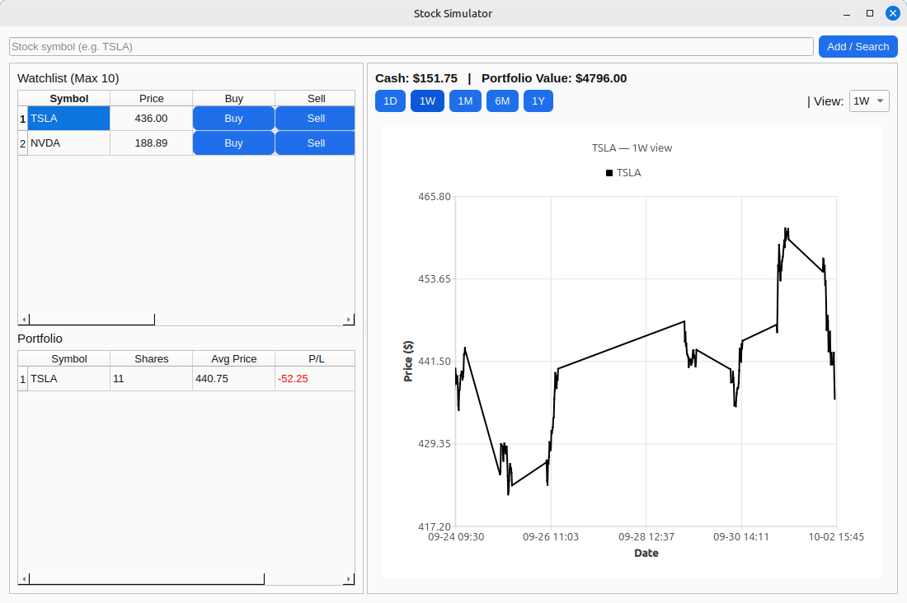

# Stock Simulator

A desktop application for simulating stock trading with real-time (delayed) data from Yahoo Finance. Built with PySide6 and Qt Charts for a professional UI.

## Features

- Watchlist management (up to 10 stocks)
- Portfolio simulation (buy/sell stocks)
- Real-time price updates with caching
- Interactive charts with multiple timeframes (1D, 1W, 1M, 6M, 1Y)
- SQLite database for persistence
- Adjustable UI panels with scroll bars

## Screenshots



## Installation

1. Clone or download the repository.
2. Install dependencies:
   ```
   pip install PySide6 yfinance
   ```
3. Run the application:
   ```
   python stocksim.py
   ```

## Usage

- Enter a stock symbol (e.g., TSLA) and click "Add / Search" to add to watchlist.
- Use the buttons to buy/sell stocks from the watchlist.
- Select timeframes to view charts.
- Prices update every 60 seconds (cached for 5 minutes to reduce API calls).

## Requirements

- Python 3.8+
- PySide6
- yfinance
- SQLite (built-in)

## License

This project is licensed under the MIT License - see the [LICENSE](LICENSE) file for details.

## Contributing

Feel free to submit issues or pull requests.